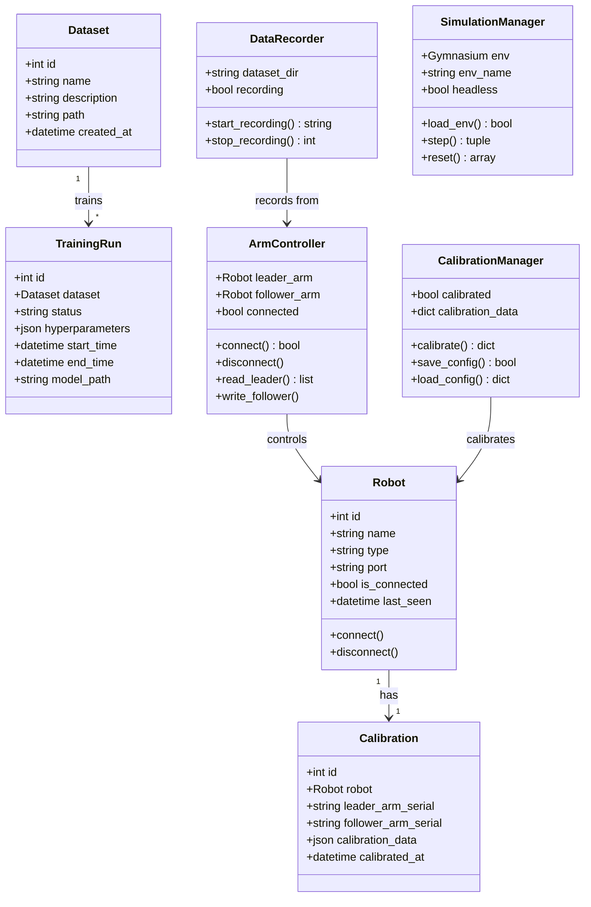

# 🤖 Robotics Control Application

A comprehensive Django-based robotics control system for robot manipulation, teleoperation, data recording, and AI training. Supports real hardware (SO101 robot arms) and simulated environments (MuJoCo, Isaac Sim).


---

## 📸 Application Overview

### Dashboard
```
┌──────────────────────────────────────────────────────────────────┐
│  🤖 Robotics Control Dashboard                                   │
├──────────────────────────────────────────────────────────────────┤
│                                                                  │
│  ┌─────────────┐  ┌─────────────┐  ┌─────────────┐              │
│  │ 🔌 Connect  │  │ 🎮 Control  │  │ 📷 Cameras  │              │
│  │   Robot     │  │   Robot     │  │   View      │              │
│  └─────────────┘  └─────────────┘  └─────────────┘              │
│                                                                  │
│  ┌─────────────┐  ┌─────────────┐  ┌─────────────┐              │
│  │ 🎯 Calibrate│  │ 📊 Record   │  │ 🧠 Train    │              │
│  │   Arms      │  │   Dataset   │  │   AI Model  │              │
│  └─────────────┘  └─────────────┘  └─────────────┘              │
│                                                                  │
│  Status: ● Connected  |  Mode: Teleoperation  |  FPS: 30        │
└──────────────────────────────────────────────────────────────────┘
```

### Robot Manipulation Interface
```
┌──────────────────────────────────────────────────────────────────┐
│  🎮 Robot Manipulation                                           │
├──────────────────────────────────────────────────────────────────┤
│                                                                  │
│  ┌─────────────────────────┐   ┌─────────────────────────┐      │
│  │                         │   │                         │      │
│  │    📷 Camera Feed 1     │   │    📷 Camera Feed 2     │      │
│  │    (Wrist Camera)       │   │    (Overview Camera)    │      │
│  │                         │   │                         │      │
│  └─────────────────────────┘   └─────────────────────────┘      │
│                                                                  │
│  Joint Positions:                                                │
│  ┌──────────────────────────────────────────────────────┐       │
│  │ J1: ████████████░░░░░░  45°                          │       │
│  │ J2: ██████████████████  90°                          │       │
│  │ J3: ██████░░░░░░░░░░░░  30°                          │       │
│  │ J4: ████████████████░░  80°                          │       │
│  │ J5: ██████████░░░░░░░░  50°                          │       │
│  │ J6: ████████████████████ 100° (Gripper)              │       │
│  └──────────────────────────────────────────────────────┘       │
│                                                                  │
│  [▶ Start Teleop] [⏹ Stop] [⏺ Record] [💾 Save Motion]          │
└──────────────────────────────────────────────────────────────────┘
```

---

## 🏗️ System Architecture

```
┌─────────────────────────────────────────────────────────────────────┐
│                        USER INTERFACE                               │
│  ┌─────────────────────────────────────────────────────────────┐   │
│  │   Browser (HTML5/CSS3/JavaScript)                           │   │
│  │   • Dashboard    • Manipulation    • Training               │   │
│  │   • Calibration  • Dataset View    • Camera View            │   │
│  └─────────────────────────────────────────────────────────────┘   │
└────────────────────────────┬────────────────────────────────────────┘
                             │ HTTP/REST API
                             ▼
┌─────────────────────────────────────────────────────────────────────┐
│                     DJANGO APPLICATION                              │
│  ┌──────────────┐  ┌──────────────┐  ┌──────────────┐              │
│  │   Views      │  │   Models     │  │   Forms      │              │
│  │   (API)      │  │   (Data)     │  │   (Input)    │              │
│  └──────┬───────┘  └──────────────┘  └──────────────┘              │
│         │                                                           │
│  ┌──────▼───────────────────────────────────────────────────────┐  │
│  │                   BUSINESS LOGIC LAYER                        │  │
│  │  ┌─────────────┐ ┌─────────────┐ ┌─────────────┐             │  │
│  │  │robot_utils  │ │simulation_  │ │lerobot_     │             │  │
│  │  │• ArmController│ │utils        │ │bridge       │             │  │
│  │  │• DataRecorder │ │• MuJoCo Env │ │• Teleop     │             │  │
│  │  │• Calibration  │ │• gym_hil    │ │• Recording  │             │  │
│  │  └─────────────┘ └─────────────┘ └─────────────┘             │  │
│  └──────────────────────────────────────────────────────────────┘  │
└────────────────────────────┬────────────────────────────────────────┘
                             │
           ┌─────────────────┼─────────────────┐
           ▼                 ▼                 ▼
┌──────────────────┐ ┌──────────────┐ ┌──────────────────┐
│   REAL ROBOT     │ │   MUJOCO     │ │   ISAAC SIM      │
│  ┌────────────┐  │ │  ┌────────┐  │ │  ┌────────────┐  │
│  │ SO101 Arms │  │ │  │Physics │  │ │  │ 3D Render  │  │
│  │ • Leader   │  │ │  │Engine  │  │ │  │ • URDF     │  │
│  │ • Follower │  │ │  │• gym   │  │ │  │ • Physics  │  │
│  └────────────┘  │ │  └────────┘  │ │  └────────────┘  │
│  Serial USB      │ │  Python API  │ │  ROS2 Bridge     │
└──────────────────┘ └──────────────┘ └──────────────────┘
```

---

## 📊 Class Diagram



---

## 🚀 Quick Start

### Prerequisites
- Python 3.12+
- macOS or Linux
- USB ports for robot arms (optional for simulation)

### Installation

```bash
# Clone the repository
git clone https://github.com/samo1279/robotics_app.git
cd robotics_app

# Create virtual environment
python -m venv .venv
source .venv/bin/activate

# Install dependencies
pip install -r requirements.txt

# Run database migrations
python manage.py migrate

# Start the server
python manage.py runserver
```

### Access the Application
Open your browser and navigate to: **http://127.0.0.1:8000/**

---

## 📁 Project Structure

```
robotics_app/
├── control/                    # Main Django app
│   ├── views.py               # HTTP request handlers
│   ├── models.py              # Database models
│   ├── urls.py                # URL routing
│   ├── robot_utils.py         # Robot control utilities
│   ├── simulation_utils.py    # MuJoCo simulation
│   ├── isaac_sim_utils.py     # Isaac Sim integration
│   ├── lerobot_bridge.py      # LeRobot integration
│   ├── templates/             # HTML templates
│   │   └── control/
│   │       ├── home.html
│   │       ├── manipulation.html
│   │       ├── calibrate.html
│   │       ├── train.html
│   │       └── ...
│   └── static/                # CSS, JS, images
│       └── control/
│           └── css/
├── robotics_app/              # Django project settings
│   ├── settings.py
│   ├── urls.py
│   └── wsgi.py
├── dataset/                   # Recorded datasets
├── training/                  # Trained models
├── simulation_configs/        # Simulation configurations
├── docs/                      # Documentation
├── requirements.txt           # Python dependencies
├── manage.py                  # Django management
└── README.md                  # This file
```

---

## 🎯 Features

### 1. Robot Connection & Control
- **Auto-detect** USB serial ports
- **Teleoperation** - Control follower arm with leader arm
- **Real-time** joint position monitoring
- **Safety limits** enforcement

### 2. Visual Calibration
- **Camera integration** with Intel RealSense
- **Hand-eye calibration** workflow
- **Save/Load** calibration configurations

### 3. Data Recording
- **Episode-based** recording for imitation learning
- **Multi-modal** data (joints, cameras, timestamps)
- **JSONL format** compatible with LeRobot/HuggingFace

### 4. AI Training
- **Imitation learning** from recorded demonstrations
- **Integration** with LeRobot library
- **Model export** for deployment

### 5. Simulation
- **MuJoCo** physics simulation
- **Isaac Sim** support for advanced 3D visualization
- **Human-in-the-Loop** (HiL) training mode

---

## 🔌 API Endpoints

| Endpoint | Method | Description |
|----------|--------|-------------|
| `/` | GET | Dashboard home page |
| `/robot_connection/` | GET | Robot connection interface |
| `/manipulation/` | GET | Robot manipulation control |
| `/calibrate/` | GET | Calibration interface |
| `/cameras/` | GET | Camera feed view |
| `/train/` | GET | AI training interface |
| `/dataset/` | GET | Dataset management |
| `/api/robot/connect/` | POST | Connect to robot |
| `/api/robot/disconnect/` | POST | Disconnect robot |
| `/api/robot/status/` | GET | Get robot status |
| `/api/robot/teleoperation/start/` | POST | Start teleoperation |
| `/api/robot/teleoperation/stop/` | POST | Stop teleoperation |
| `/api/recording/start/` | POST | Start data recording |
| `/api/recording/stop/` | POST | Stop data recording |

---

## 🛠️ Configuration

### Robot Configuration (`robot_config.json`)
```json
{
  "robot_type": "manipulator",
  "voltage": "24V",
  "joint_limits": {
    "joint_1": {"min": -170.0, "max": 170.0},
    "joint_2": {"min": -90.0, "max": 90.0},
    ...
  },
  "home_position": [0.0, 0.0, 0.0, 0.0, 0.0, 0.0],
  "pid_gains": {"p_gain": 32, "i_gain": 0, "d_gain": 32}
}
```

### Environment Variables
```bash
# Optional: For HuggingFace dataset uploads
export HF_TOKEN="your_huggingface_token"

# Optional: For Isaac Sim integration
export ISAAC_SIM_PATH="/path/to/isaac_sim"
```

---

## 🧪 Testing

```bash
# Run all tests
python test_robotics_app.py

# Test LeRobot integration
python test_lerobot_integration.py

# Test simulation
python test_simulation.py
```

---

## 📚 Documentation

- [Software Documentation](SOFTWARE_DOCUMENTATION.md) - Complete technical reference
- [Class Diagram](CLASS_DIAGRAM.md) - Detailed class relationships
- [LeRobot Integration](docs/LEROBOT_INTEGRATION.md) - LeRobot setup guide
- [Visual Calibration Guide](VISUAL_CALIBRATION_GUIDE.md) - Calibration workflow
- [Simulation Setup](README_simulation.md) - MuJoCo/Isaac Sim setup

---

## 🔧 Troubleshooting

### Robot Not Detected
```bash
# List available ports
ls /dev/tty.usbmodem*

# Check USB connection
system_profiler SPUSBDataType
```

### LeRobot Import Error
```bash
# Ensure you have ~3GB disk space
pip install lerobot
```

### Camera Issues
```bash
# Install RealSense SDK
pip install pyrealsense2
```

---

## 🤝 Contributing

1. Fork the repository
2. Create a feature branch (`git checkout -b feature/amazing-feature`)
3. Commit your changes (`git commit -m 'Add amazing feature'`)
4. Push to the branch (`git push origin feature/amazing-feature`)
5. Open a Pull Request

---

## 📄 License

This project is licensed under the MIT License - see the [LICENSE](LICENSE) file for details.

---

## 👨‍💻 Author

**Sepehr Mortazavi** - [GitHub](https://github.com/samo1279)

---

## 🙏 Acknowledgments

- [LeRobot](https://github.com/huggingface/lerobot) - HuggingFace robotics library
- [MuJoCo](https://mujoco.org/) - Physics simulation
- [NVIDIA Isaac Sim](https://developer.nvidia.com/isaac-sim) - 3D simulation
- [Django](https://www.djangoproject.com/) - Web framework
