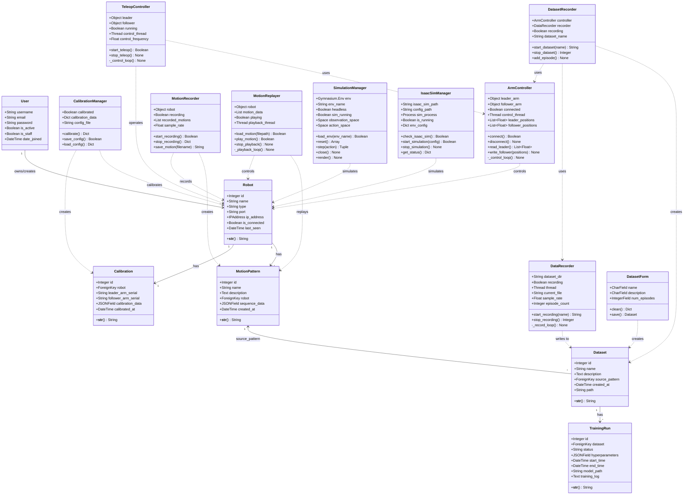
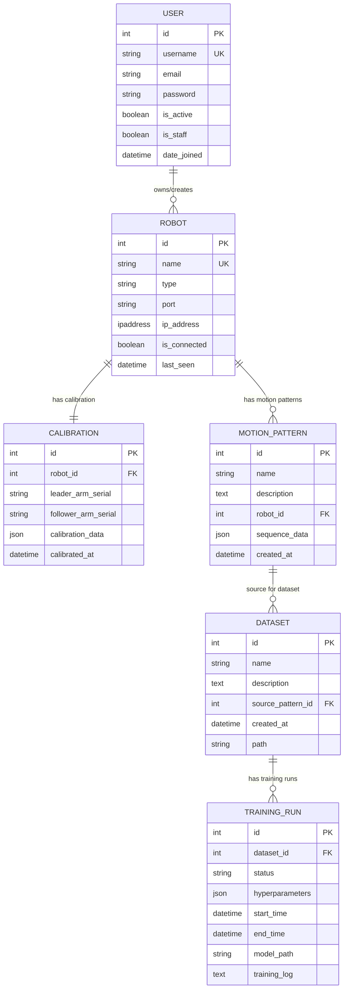
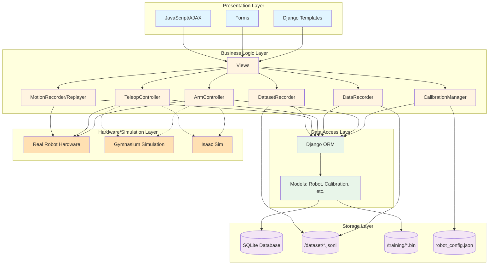
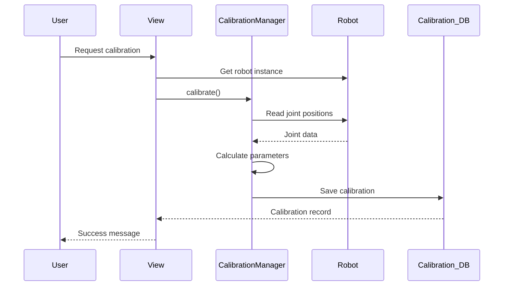
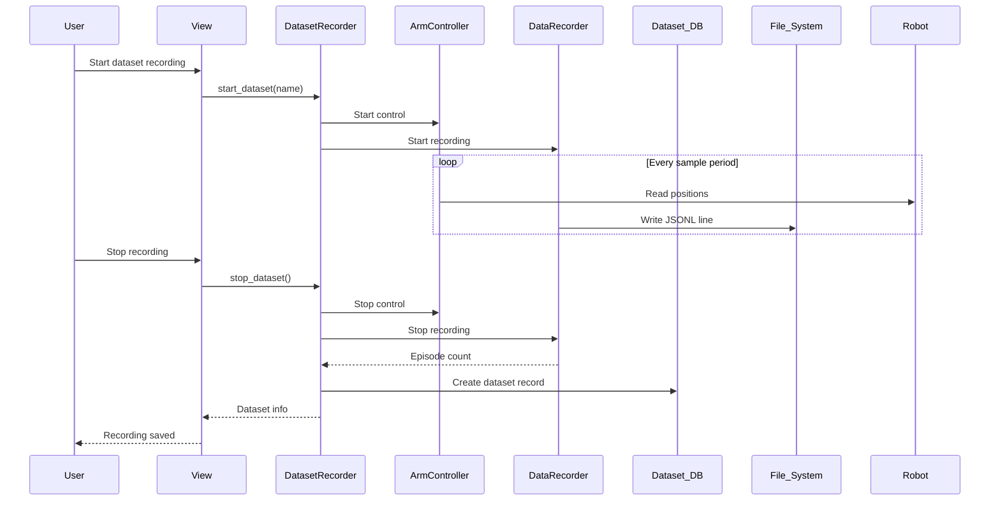
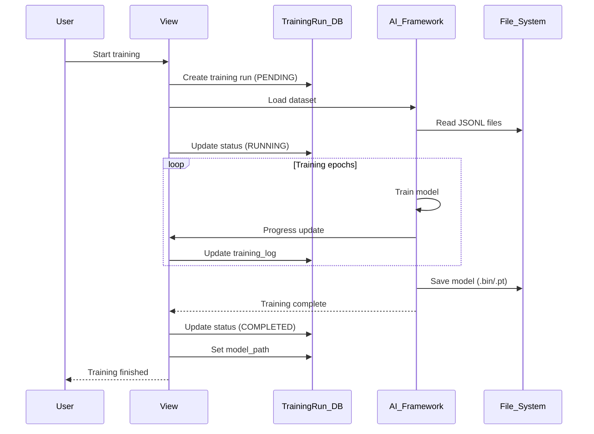
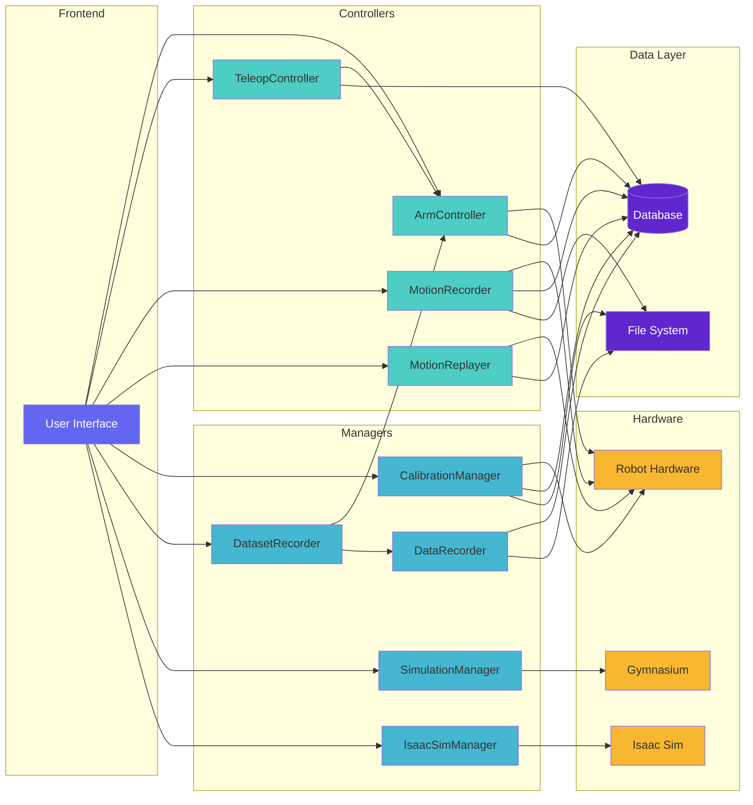
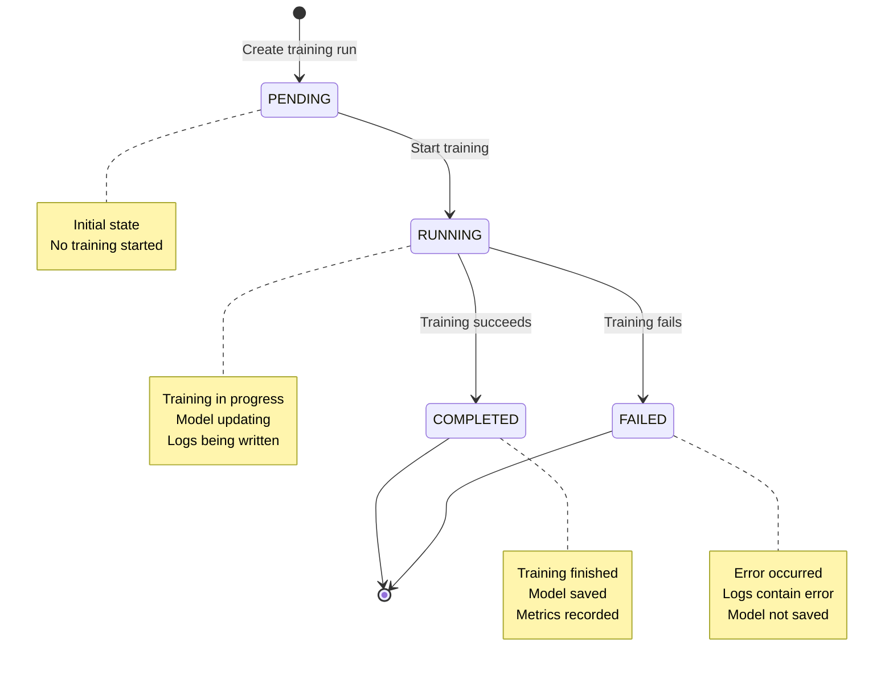
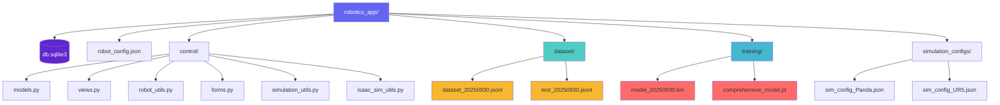

# Robotics Application - Visual Class Diagram (Mermaid)

## UML Class Diagram

This diagram can be viewed in GitHub, VS Code (with Mermaid extension), or any Mermaid-compatible viewer.

---

## Entity Relationship Diagram (ERD)

---

## System Architecture Flow

---

## Data Flow Diagrams

### 1. Calibration Flow

### 2. Dataset Recording Flow

### 3. Training Flow

---

## Component Interaction Map

---

## State Machine: Training Run Status

---

## File Structure Tree

---

## Usage Examples

### Rendering in VS Code
1. Install "Markdown Preview Mermaid Support" extension
2. Open this file in VS Code
3. Press `Ctrl+Shift+V` (or `Cmd+Shift+V` on Mac) to preview

### Rendering in GitHub
- GitHub automatically renders Mermaid diagrams in markdown files
- Just push this file to your repository

### Exporting as Image
- Use [Mermaid Live Editor](https://mermaid.live/)
- Copy-paste the diagram code
- Export as PNG/SVG

---

## Summary

This comprehensive class diagram shows:

✅ **5 Django Models** (Robot, Calibration, MotionPattern, Dataset, TrainingRun)  
✅ **9 Utility Classes** (Managers, Controllers, Recorders)  
✅ **1 Form Class** (DatasetForm)  
✅ **All Relationships** (1:1, 1:N, N:1)  
✅ **Data Flow** (Calibration, Recording, Training)  
✅ **System Architecture** (Layered design)  
✅ **Component Interactions** (How classes work together)  
✅ **File Structure** (Storage organization)

The diagrams provide multiple perspectives on the same system, making it easy to understand how your robotics application works! 🤖✨
