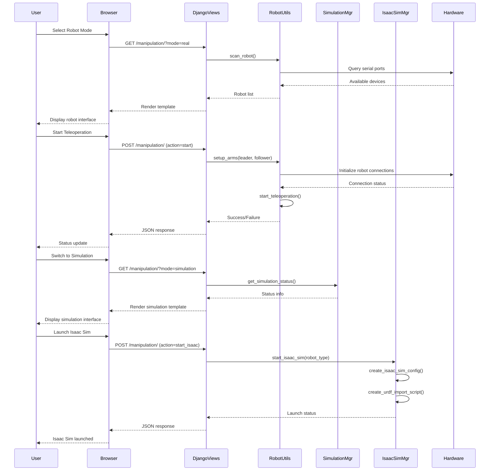

# 🏗️ System Architecture - Class Diagrams and Layer Documentation

## 📊 UML Class Diagram

### Core System Architecture

```mermaid
classDiagram
    %% Django Framework Layer
    class DjangoApp {
        +settings: Settings
        +urls: URLConf
        +wsgi: WSGIApplication
        +manage(): void
    }

    %% Web Layer
    class ControlViews {
        +home(request): HttpResponse
        +connect(request): HttpResponse
        +calibrate(request): HttpResponse
        +record(request): HttpResponse
        +train(request): HttpResponse
        +manipulation(request): HttpResponse
        +ai_control(request): HttpResponse
        -_handle_robot_mode(): void
        -_handle_simulation_mode(): void
        -_handle_isaac_mode(): void
    }

    class ControlURLs {
        +app_name: str
        +urlpatterns: List[URLPattern]
        +api_routes: List[URLPattern]
    }

    class ControlForms {
        +DatasetForm
        +validate_input(): bool
    }

    %% Data Layer
    class Dataset {
        +id: int
        +name: str
        +description: str
        +created_at: datetime
        +path: str
        +__str__(): str
    }

    %% Robot Hardware Layer
    class RobotUtils {
        +scan_robot(): List[str]
        +list_cameras(): List[str]
        +train_model(dataset_path, output_dir): str
        +run_ai_control(model_path): bool
        +get_robot_status(): Dict
    }

    class CalibrationManager {
        +calibrated: bool
        +data: Dict[str, Any]
        +calibrate(): Dict[str, Any]
        +save_calibration(): void
        +load_calibration(): void
        +is_calibrated(): bool
    }

    class DataRecorder {
        +recording: bool
        +dataset_dir: str
        +current_episode: int
        +session_name: str
        +start_recording(session_name): bool
        +record_frame(data): void
        +stop_recording(): str
        +get_recording_status(): Dict
    }

    class ArmController {
        +leader_arm: str
        +follower_arm: str
        +control_active: bool
        +setup_arms(leader, follower): bool
        +start_teleoperation(mode): bool
        +stop_teleoperation(): bool
        +emergency_stop(): void
        +send_joint_command(commands): bool
        +get_arm_position(): Dict
    }

    %% Simulation Layer
    class SimulationManager {
        +simulation_running: bool
        +simulation_process: subprocess.Popen
        +current_task: str
        +config_dir: Path
        +check_gpu_available(): bool
        +start_simulation(task, control_mode): bool
        +stop_simulation(): bool
        +start_recording(task, episodes): bool
        +start_training(task): bool
        +get_simulation_status(): Dict
        +create_simulation_config(task, mode): str
    }

    %% Isaac Sim Integration Layer
    class IsaacSimManager {
        +isaac_sim_running: bool
        +isaac_process: subprocess.Popen
        +urdf_path: str
        +robot_loaded: bool
        +config_dir: Path
        +check_isaac_sim_available(): bool
        +start_isaac_sim(robot_type, urdf_path): bool
        +stop_isaac_sim(): bool
        +create_isaac_sim_config(robot_type): str
        +create_urdf_import_script(urdf_path, robot_name): str
        +create_ros2_bridge_config(): str
        +create_robot_urdf(robot_type): str
        +get_isaac_sim_status(): Dict
    }

    %% External Integration Classes
    class SerialInterface {
        +port: str
        +baudrate: int
        +connection: serial.Serial
        +connect(): bool
        +disconnect(): void
        +send_command(cmd): bool
        +read_response(): str
    }

    class MuJoCoEnvironment {
        +env_name: str
        +env: gymnasium.Env
        +observation_space: Space
        +action_space: Space
        +create_env(task): gymnasium.Env
        +reset(): Tuple
        +step(action): Tuple
        +render(): ndarray
        +close(): void
    }

    class IsaacSimEnvironment {
        +world: World
        +robot: Robot
        +stage: Stage
        +physics_context: PhysicsContext
        +launch_isaac_sim(): bool
        +import_urdf(urdf_path): bool
        +setup_ros2_bridge(): bool
        +start_simulation_loop(): void
    }

    %% Relationships
    DjangoApp ||--|| ControlViews : contains
    DjangoApp ||--|| ControlURLs : routing
    ControlViews ||--|| Dataset : queries
    ControlViews ||--|| RobotUtils : uses
    ControlViews ||--|| SimulationManager : manages
    ControlViews ||--|| IsaacSimManager : manages
    
    RobotUtils ||--|| CalibrationManager : contains
    RobotUtils ||--|| DataRecorder : contains
    RobotUtils ||--|| ArmController : contains
    RobotUtils ||--|| SerialInterface : uses
    
    SimulationManager ||--|| MuJoCoEnvironment : manages
    IsaacSimManager ||--|| IsaacSimEnvironment : manages
    
    CalibrationManager --|> SerialInterface : communicates
    ArmController --|> SerialInterface : controls
    DataRecorder --|> Dataset : creates
```

### Detailed Component Interaction



## 🏛️ Layer Architecture Documentation

### 1. Presentation Layer (Web Interface)

#### Templates Structure
```
templates/control/
├── base.html                 # Base template with common elements
├── home.html                 # Dashboard with navigation
├── manipulation.html         # Multi-mode control interface
├── connect.html              # Robot connection interface
├── calibrate.html            # Calibration interface
├── record.html               # Data recording interface
├── train.html                # Model training interface
├── ai_control.html           # AI control interface
└── cameras.html              # Camera management interface
```

#### Static Assets Structure
```
static/control/
├── css/
│   └── style.css             # Application styles
├── js/
│   ├── api.js                # API communication functions
│   ├── ui.js                 # UI interaction handlers
│   └── robotics.js           # Robotics-specific functions
└── images/
    ├── robot-icon.png        # Robot imagery
    └── simulation-bg.jpg     # Background images
```

The comprehensive architecture shows how all components interact in this
their relationships:

* **CalibrationManager** manages calibration state and data.
* **DataRecorder** handles the lifecycle of recording data to a file.
* **RobotUtils** groups standalone utility functions for hardware
  interaction (scanning robots, listing cameras, training and AI
  control). In the implementation these functions live directly in
  `robot_utils.py` but are conceptually grouped here.
* **Dataset** is a Django model storing metadata about recorded files.
* **Views** corresponds to functions in `views.py` that handle HTTP
  requests. Views call into the managers and utilities to perform
  actions and render templates.

Use this diagram as a reference when extending the application or
refactoring its architecture. Additional classes (e.g. for camera
streams, authentication or asynchronous jobs) can be added and linked
in a similar fashion.
